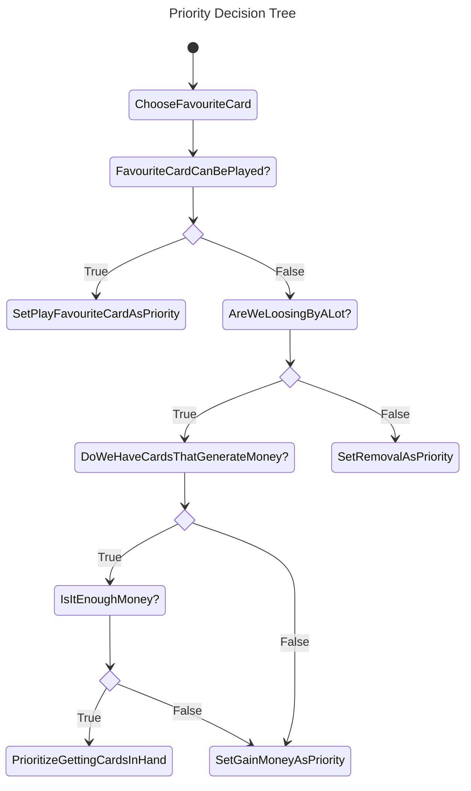
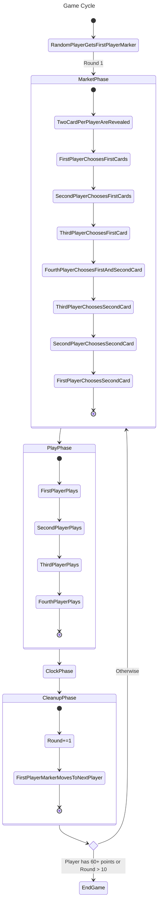

# Vale of Eternity — AI Simulation

> Final project for an Artificial Intelligence in Videogames course.  
> Full Unity 6 implementation of the board game *Vale of Eternity* where **four AI agents compete autonomously**, each trying to maximise their score through card synergies, resource management, and opponent disruption.


---

## Screenshot


*Four AI agents in Round 10. Live metrics panel on the right, per-player tableau zones, and the Hunt Zone (card market) visible at all times.*

---

## What this project is

*Vale of Eternity* is a card-drafting board game where players hunt fantasy creatures to score points. The currency system is intentionally lossy — coins come in denominations of 1, 3, and 6, you hold at most four, and you never get change — which forces every purchase decision to carry real consequence.

This implementation runs four AI players through a complete match (up to 10 rounds or until someone reaches 60 points) with no human input. The AI was designed, implemented, tuned, and tested solo over the course of the subject.

**Why it's an interesting AI problem:**
- Large, partially observable action space (68 unique cards, each with distinct effects)
- Delayed rewards — cards played now pay off several rounds later
- Multi-agent: optimal play depends on what others are doing
- Resource constraint makes every coin spent a real trade-off

---

## Key Technical Highlights

| Area | What was built |
|---|---|
| **Game engine** | Full rule implementation in Unity 6 (C#): all 68 cards with unique effects, coroutine-driven game loop, event-based card triggers |
| **AI architecture** | Priority-driven agent with dynamic priority recalculation on every state change |
| **Card evaluation** | Synergy scoring via `EnablerFlags` / `PayoffFlags` bitmasks — cards tag what archetypes they enable vs. reward |
| **Clock phase solver** | Monte Carlo Rollout tree search over all card activation orderings |
| **Uncertainty handling** | Probabilistic valuation for draw effects based on strategy dispersion |
| **Tuning** | 6 parameterisation runs with 10 games each, with quantitative score tracking |

---

## AI Architecture

The agents operate in three distinct phases, each with its own decision algorithm.

### 1 — Priority System (governs all phases)

Each agent maintains a live priority list. It recalculates whenever the agent's hand, tableau, or currency changes — or when an opponent takes an action that affects the board state.

Priorities (ordered):

1. **Play favourite card** — if the card is in hand and payable
2. **Gain money** — if broke or blocked
3. **Draw cards** — if outpaced and money is sufficient
4. **Play removal** — if an opponent is pulling ahead



### 2 — Card Synergy Scoring

Every card carries two bitmask fields:

- **EnablerFlags** — which archetypes this card sets up
- **PayoffFlags** — which archetypes reward this card

Cards in hand/tableau are scanned and the overlap is scored. Cards in the tableau count double vs. cards still in hand.

```cpp
int ponderate_points_of_card(CardNameId cni) {
  int enabler_ponderation = 2 * (payoff flags matching tableau enablers)
                          + 1 * (payoff flags matching hand enablers);
  int payoff_ponderation  = 2 * (enabler flags matching tableau payoffs)
                          + 1 * (enabler flags matching hand payoffs);
  int points_on_play      = CardData.getCard(cni).estimated_points_on_play;
  int points_per_round    = rounds_remaining * CardData.getCard(cni).estimated_points_per_round;

  return enabler_ponderation + payoff_ponderation + points_on_play + points_per_round;
}
```

**Archetypes tracked** (22 total): `big_hand`, `familyR/G/B/P/D`, `stones1/3/6`, `number_of_families`, `clocks`, `etbs`, `recursion`, `removal`, `space_free`, `high_costs`, `low_costs`, `loose_points`, `cost_reduction`, `multicast`, `tableau_width`.

### 3 — Clock Phase: Monte Carlo Rollout

During the end-of-turn clock activation phase, card order matters. The solver does a full exhaustive tree search over all orderings, evaluating each leaf against the agent's current priorities.

```cpp
void MonteCarloClockResolutor(
    List<ClockActivation> activation_order,
    Rewards rew,
    List<CardNameId> cards_to_activate,
    int depth)
{
  if (no_more_cards_to_choose) {
    int value = ponderate_reward(player_priorities, rew);
    if (value > best_solution.value)
      best_solution = (value, activation_order.DeepCopy());
    return;
  }
  foreach (card in remaining_cards) {
    foreach (Decision d in card.decisions) {
      rew += card.get_reward(d);
      activation_order[card] = ClockActivation(depth, d);
      MonteCarloClockResolutor(activation_order, rew, remaining, depth+1);
      // backtrack
      activation_order[card] = ClockActivation(-1, -1);
      rew -= card.get_reward(d);
    }
  }
}
```

**Uncertainty handling:** draw effects are valued probabilistically. A high `strategy_predominance` (one archetype dominating) lowers the draw value — the agent already has a focused line and random cards add less expected value.

```cpp
int ponderate_draw(Player p) {
  float strategy_predominance = p.max_synergy() / p.total_synergy();
  int   big_hand_value        = p.synergies[BIG_HAND];
  return (int)((1 - strategy_predominance) * 100) + big_hand_value * 10;
}
```

---

## Parameterisation Results

Six evaluation function variants were tested over 10 games each. Scores reflect final victory points per player.

### Parameterisation 5 — Best overall (avg 24.3)

Increased weight on affordable "favourite card" picks, reducing agents getting currency-locked.

| Game | P1 | P2 | P3 | P4 | Avg |
|---|---|---|---|---|---|
| 1 | 28 | 50 | 0 | 13 | 22.75 |
| 2 | 20 | 48 | 40 | 35 | 35.75 |
| 3 | 55 | 13 | 32 | 30 | 32.5 |
| 4 | 19 | 35 | 9 | 16 | 19.75 |
| 5 | 10 | 35 | 9 | 6 | 15 |
| 6 | 23 | 34 | 25 | 6 | 22 |
| 7 | 57 | 20 | 26 | 0 | 25.75 |
| 8 | 23 | 24 | 17 | 15 | 19.75 |
| 9 | 19 | 56 | 0 | 11 | 21.5 |
| 10 | 20 | 22 | 45 | 30 | 29.25 |

**Mean: 24.3** — highest across all runs.

<details>
<summary>Other parameterisations</summary>

| Run | Evaluation function | Flag set | Mean score |
|---|---|---|---|
| 1 | `ceil(payoffs ^ enablers)` | v1 | 20.3 |
| 2 | `enablers + payoffs * enablers` | v2 | 16.0 |
| 3 | `enablers + payoffs * enablers` | v1 | 16.7 |
| 4 | `ceil(payoffs ^ enablers)` | v2 | 18.8 |
| **5** | v1 + playability bonus on hand cards | v1 | **24.3** |
| 6 | Bonus restricted to non-market cards | v1 | 21.5 |

</details>

A skilled human player typically scores 50–60 in a 4-player game by round 10. The AI consistently reaches the 20–35 range, with individual agents occasionally breaking 55+.

---

## Game Rules — Quick Reference

<details>
<summary>Expand</summary>

The game runs for up to **10 rounds**, ending early if any player hits **60 points**.

### Round structure



### Actions available on a player's turn

- **Play a card** — pay its cost, place it on your tableau
- **Capture a card** — move a card from the market to your hand
- **Sell a card** — discard a market card, gain its currency value
- **Remove a card** — pay equal to the round number, discard one of your tableau cards

### Currency

Coins: 1, 3, and 6 value. Max 4 held at once. No change given on purchases.

### Sell values by card family

| Family | Coins received |
|---|---|
| Red | 3 × 1 |
| Green | 4 × 1 |
| Blue | 1 × 3 |
| Pink | 1 × 3 + 1 × 1 |
| Dragon | 1 × 6 |

Full rules: [VOE_RULEBOOK_EN.pdf](VOE_RULEBOOK_EN.pdf)

</details>

---

## Code Structure

| File | Responsibility |
|---|---|
| [`GameManager.cs`](VOE/Assets/Scripts/GameManager.cs) | Game loop, phase transitions, coroutine orchestration |
| [`Player.cs`](VOE/Assets/Scripts/Player.cs) | Agent decision-making, priority calculation, action execution |
| [`CardData.cs`](VOE/Assets/Scripts/CardData.cs) | Card parameters: family, cost, enabler/payoff flags, point estimates |
| [`CardFunc.cs`](VOE/Assets/Scripts/CardFunc.cs) | Effect implementations: clock, enter, exit, trigger |
| [`CardFlags.cs`](VOE/Assets/Scripts/CardFlags.cs) | Archetype bitmask definitions |
| [`MonteCarloClockSimulator.cs`](VOE/Assets/Scripts/MonteCarloClockSimulator.cs) | Clock phase solver |
| [`MarketRound.cs`](VOE/Assets/Scripts/MarketRound.cs) | Draft phase logic |
| [`CardAreaManager.cs`](VOE/Assets/Scripts/CardAreaManager.cs) | Tableau/hand layout via lerped grid |
| [`StoneRepresentator.cs`](VOE/Assets/Scripts/StoneRepresentator.cs) | Currency UI |

---

## How to Run

**Executable:** download from the [v1.0 release](../../releases/tag/v1.0) and run directly.

**From source:** open the project in **Unity 6 (6000.2.15 LTS)**, load `Assets/MainMenu.unity`, and hit Play.

---

## References

- [Vale of Eternity Wiki](https://valeofeternity.wiki.gg)
- [Monte Carlo Tree Search — Wikipedia](https://en.wikipedia.org/wiki/Monte_Carlo_tree_search)
- [Monte Carlo Rollouts for card games — YouTube](https://www.youtube.com/watch?v=lmSRnG4eaKs&t=635s)
- [Writing AI for card games — whisthub.com](https://www.whisthub.com/blog/how-to-write-an-ai-for-a-card-game)
- [Probability & Utility in Game AI — narratech.com](https://narratech.com/es/inteligencia-artificial-para-videojuegos/decision/probabilidad-y-utilidad/)
- [VOE Rulebook (EN)](VOE_RULEBOOK_EN.pdf)
