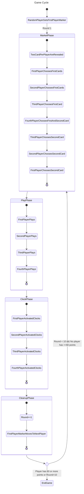
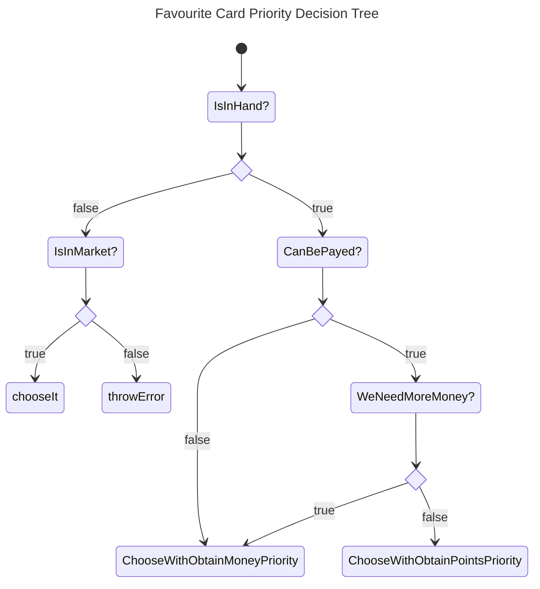

# Vale of Eternity

## Instalación y uso

Todo el contenido del proyecto está disponible aquí en el repositorio y usa **Unity 6 (6000.2.15 LTS)**.

Al no estar publicada todavía ninguna versión ejecutable del prototipo, ni enlazado ningún video con las pruebas realizadas, es necesario abrir el proyecto en Unity y usarlo desde allí.

## Introducción

Este proyecto es una adaptación del homónimo juego de mesa (sin expansiones).

En este proyecto los distintos jugadores están controlados por una inteligencia artificial.

Esta inteligencia artificial se basa en probabilidades. Y buscará sinergias para obtener la mayor cantidad de puntos posibles. Denegando puntos a los rivales si considera que es la mejor estrategia.

Se considera que el juego es un punto de partida interesante porque contiene una gran cantidad de pequeñas decisiones con repercusiones a medio o largo plazo.

## Sinopsis del Juego

En este juego los distintos jugadores son cazadores de criaturas fantásticas. Deberan capturarlas o comerciar con ellas para obtener el máximo número de puntos posibles.

La característica más interesante del juego es su sistema de divisa. Pues hay monedas de 3 tipos. De valor 1, 3 y 6. Cada jugador solo puede tener hasta cuatro piedras en cualquier momento y al gastar cualquiera no obtendrá cambio.

Cada carta tiene una familia (color), un coste y uno o varios efectos.

## Reglas de Juego

Estas reglas están enfocadas a entender el proyecto, aquellas cosas enfocadas al juego físico han sido obviadas. Para una vista de las reglas completas haz clic [aquí](VOE_RULEBOOK_EN.pdf).

El juego se desarrolla en rondas. Hasta jugar 10 o hasta que algún jugador obtenga 60 puntos.

Este juego tiene un mazo compartido por todos los jugadores.

### Inicio de Partida

Se decide el jugador que comenzará de forma aleatoria. Este obtiene el token de primer jugador.

Cada jugador comienza con tantos puntos como número de jugador sea durante el primer turno. En una partida de cuatro jugadores empezarán con 1, 2, 3 y 4. Siendo el jugador con un punto aquel con el token de primer jugador.

A partir de ahora numeraremos los jugadores con su número respecto al jugador con el token de primer jugador. En sentido antihorario.

Dentro de cada ronda hay varias fases:



### Fase de Caza

Durante la fase de caza se revelan tantas cartas del mazo como el doble de jugadores esten jugando.

Estas cartas se colocan en el mercado.

Durante esta fase cada jugador tendrá que colocar uno de sus marcadores en una de las cartas en el mercado.
Esta fase acaba cuando todas las cartas reveladas tengan un marcador de jugador sobre ellas.

Los jugadores se tornan poniendo marcadores en este orden:
>> 1 > 2 > 3 > 4 > 4 > 3 > 2 > 1

Siendo 1 el jugador con el token de primer jugador, y 2 el jugador a su derecha.

### Fase de Juego

Cada jugador jugara su turno en sentido antihorario. En este orden:
>> 1 > 2 > 3 > 4

Durante su turno cada jugador puede hacer cualquier número de las siguientes acciones en cualquier orden.

- **Jugar una carta**. Pagando el coste de una carta en la mano colocala en la mesa.
- **Capturar una carta**. Quita uno de tus marcadores de jugador de una de las cartas del mercado y ponla en tu mano.
- **Vende una carta**. Quita uno de tus marcadores de jugador de una de las cartas del mercado, colocala en descartes. Gana la divisa correspondiente.
- **Eliminar una carta**. Paga igual valor al número de ronda. Descarta una de las cartas en tu mesa.

### Fase de activación

Activa los efectos de final de turno de las cartas en tu zona de la mesa.
Puedes elegir el orden en el que resolver los efectos. Pero es obligatorio activar todos.

### Fase Final

Suma uno al número de ronda.

El siguiente jugador en sentido antihorario consigue el token de primer jugador.

### Jugar una carta

Antes de jugar una carta hay que pagar su coste. Descartando las monedas que se usen para pagar por su coste de antemano.

Las cartas puede tener uno o más de los siguientes efectos:

- **Instantaneo** al jugarse este efecto se hace de inmediato. En caso de ser un efecto que cuente criaturas en mesa. La criatura con este efecto se cuenta.
- **Infinito** mientras esta carta está en la mesa se hace este efecto se aplica. En caso de ser un efecto que cuente criaturas. Esta criatura no se cuenta en el efecto.
- **Final** al final de cada turno haz este efecto

__El número máximo de cartas en mesa es igual al número de ronda__

### Vender una carta

Al vender una carta gana las siguientes monedas según la familia de la carta:

- **Rojo** 3 monedas de 1 de valor
- **Verde** 4 monedas de 1 de valor
- **Azul** 1 moneda de 3 de valor
- **Rosa** 1 moneda de 3 de valor y 1 de 1 de valor
- **Dragones** 1 moneda de 6 de valor

En caso de obtener más monedas de las que puede tener un jugador, el jugador podrá elegir que monedas de las posibles obtener.

En caso de obtener monedas en exceso no se pueden eliminar monedas de aquellas que ya se tenían. Se tendrán que escoger siempre de las obtenidas al vender la carta.

## Punto de partida

Se parte únicamente de las reglas en formato físico del juego, y de las imagenes de las cartas y objetos extraidas de la [wiki](https://valeofeternity.wiki.gg) del juego.

El proyecto de unity parte de un proyecto vacio.

## Planteamiento del Problema

La práctica consiste en desarrollar este juego para un soporte digital en la que todos los jugadores estén controlados por la IA desarrollada.

- **A.** En la pantalla se pueden ver las distintas zonas del juego claramente diferenciadas. Estas son mercado, tablero y mano de cada jugador. El tablero de todos los jugadores será visible en todo momento. Se podrá seleccionar la mano de que jugador ver presionando sobre el número del jugador. Y un marcador de un ojo sustituirá el número del jugador cuya mano se esté viendo.
Jugablemente, todas las cartas tienen sus efectos definidos. Se pueden ver la divisa que posee cada jugador en su zona y los puntos de victoria actuales que posee.

- **B.** Durante la fase de caza, cada jugador escoge cartas a su debido tiempo hasta tener 2. Las cartas se escogeran teniendo en cuenta posibles sinergias con cartas en la mesa o mano del jugador correspondiente, su precio de venta o si con alguna carta otro de los jugadores podría sacar una gran ventaja. El parametro decisivo viene dado por una lista de prioridades ordenadas.

- **C.** Durante la fase de juego, cada jugador escoge cartas con su marcador en el mercado y las pone en su mano o las vende. Además de jugar cartas de entre estas o que ya tuviese en su mano o eliminar alguna de la mesa. Tomarán tantas acciones de las anteriores como pueda o crea oportuno para maximizar los puntos ganados o crear una situación favorable en turnos posteriores. Que cartas jugar viene dado por las sinergias con cartas en la mesa, requerimientos para jugarlas o aprovechar los efectos de las cartas con el fin de obtener más puntos que los rivales al final de la partida. Todo esto gobernado por la lista de prioridades.

- **D.** Durante la fase de relojes, caja jugador escoge el orden en que resolver los efectos de relojes de las cartas en su mesa. Intentando maximizar el número de puntos o la obtención de divisa o cartas en mano para el próximo turno. El parametro decisivo viene dado por una lista de prioridades.
Este algoritmo usará como base el algoritmo de resolución de problemas con incertidumbre **[Monte Carlo Rollout](https://en.wikipedia.org/wiki/Monte_Carlo_tree_search)**

- **E.** Cada jugador defina una lista de prioridades ordenadas a seguir. Estas prioridades se recalculan en los momentos en los que una acción del propio jugador o una acción de un oponente cambie el estado de su mesa, mano o divisa. Todas las acciones posibles de un jugador se rigen por esta lista de prioridades. El algoritmo que calcula las prioridades tendrá como misión maximizar la obtención de puntos relativa al resto de jugadores. En algunos casos esto implicará jugar efectos que no obtengan la mayor cantidad de puntos, pero que frenen el avance de otro jugador.

Para confirmar el comportamiento de la IA, se dispondrán de métricas visibles durante la partida y al final de ella. Estas incluyen, puntos de victoria finales y por turno; obtención y gasto de divisa por turno; y cartas vendidas en contraste con las cartas puestas en mano o robadas.

## Diseño de la Solución

El flujo de juego y las llamadas a todas las funciones necesarias para el funcionamiento de está aplicación se encuentran en el fichero [GameManager.cs](VOE/Assets/Scripts/GameManager.cs)

### Apartado A

#### Identificación de Zonas de Juego

Una imagen de fondo nos permitirá ver delimitadas las distintas zonas de juego.
Con el mercado estando a la derecha del todo. La mano del jugador siendo la parte de abajo de la pantalla y las zonas de cada jugador en el espacio que queda, donde colocaremos las cartas de su zona, así como la divisa que tengan.

#### Zonas de Cartas

En cada zona un objeto con un componente de tipo [CardAreaManager](VOE/Assets/Scripts/CardAreaManager.cs) será el encargado de crear las cartas, objetos con un [CardComponent.cs](VOE/Assets/Scripts/CardComponent.cs) y colocarlas en la posición correcta. **CardAreaManager** tiene varios parametros, filas y columnas, y 2 transforms. Estos 2 transforms delimitan el limite inferior izquierdo y el limite superior derecho de la zona. De forma que las cartas se coloquen automáticamente en la posición adecuada en función de esto y su índice en el array que las contiene mediante una interpolación entre ambas posiciones.

#### Representación de Divisa

En la zona de cada jugador un objeto con un componente de tipo [StoneRepresentator](VOE/Assets/Scripts/StoneRepresentator.cs) se encargará de mostrar la divisa de cada jugador. Teniendo en cuenta que aunque el límite de divisa sea de 4 piedras/monedas. Hay cartas que podrían ampliarlo.

#### Cartas

Las cartas son una gran parte del trabajo. El juego cuenta con 68 cartas únicas, cada una con efectos específicos.

##### Información Fundamental

Cada una está identificada unequívocamente por un [CardNameId](VOE/Assets/Scripts/CardsEnum.cs). Y se asocian por el valor de este a la posición del array de recurso de carta (nombre de imagen) en [FileNames.cs](VOE/Assets/Scripts/FileNames.cs).

##### Parámetros de las Cartas

Todos los parametros de cada carta del juego están guardados en [CardData.cs](VOE/Assets/Scripts/CardData.cs). Cada carta tiene:

- una familia -> en enumerado entre Rojo, Azul, Verde, Rosa y Dragones
- un precio -> valor numérico
- enabler flags -> enumerado que contiene que tipo de estrategias permiten
- payoff flags -> enumerado que contiene que tipo de estrategias recompensan. De forma que al tener varias cartas con enabler flags de un tipo, las cartas con payoff flags de ese mismo tipo serán más poderosas
- funciones de:
  - reloj
  - al entrar al tablero
  - al salir del tablero

###### Funciones de Cartas

Las funciones de cada carta están almacenadas en [CardFunc.cs](VOE/Assets/Scripts/CardFunc.cs). Clasificadas en regiones según la carta de la que provienen y en clock, enter, exit y trigger.

- Clock son funciones de final de turno
- Enter son funciones al entrar en el tablero
- Exit son funciones al salir del tablero
- Trigger son funciones a las que se suscribirán distintas UnityActions de los jugadores. De forma que al entrar o al salir alguna carta del tablero el jugador se podría suscribir a una de estas funciones. En cartas por ejemplo que al pagar costes con monedas de cierto tipo proporcionan puntos de victoria.

###### Flags de Cartas

Cada carta almacena dos enteros que pueden contener distintas flags.

Las clasificamos con estas etiquetas para que la IA pueda buscar coincidencias y evaluarlas correctamente.

- EnablerFlags -> permite saber que sinergias habilita esta carta.
- PayoffFlags -> permite saber que sinergias mejoran el efecto de esta carta.

De forma que conviene tener el máximo número de cartas con enabler flags de un tipo, para hacer que el efecto de una carta con PayoffFlags de ese tipo sea lo más poderoso posible.

Los arquetipos y sinergías que se tendrán en cuenta, intentando categorizar todos los del juego, se pueden encontrar en [CardFlags.cs](VOE/Assets/Scripts/CardFlags.cs) serán:

- big_hand -> estrategia que te recompensa por tener muchas cartas en mano
- familyR -> estrategia que te recompensa por tener muchas cartas rojas
- familyB -> estrategia que te recompensa por tener muchas cartas azules
- familyG -> estrategia que te recompensa por tener muchas cartas verdes
- familyP -> estrategia que te recompensa por tener muchas cartas rosas
- familyD -> estrategia que te recompensa por tener muchas cartas dragones
- stones1 -> estrategia que te recompensa por tener o usar piedras/monedas de valor 1
- stones3 -> estrategia que te recompensa por tener o usar piedras/monedas de valor 3
- stones6 -> estrategia que te recompensa por tener o usar piedras/monedas de valor 6
- number_of_families -> estrategia que te recompensa por tener el mayor número de cartas de distintas familias en tu mesa
- clocks -> estrategia que te recompensa por tener muchas cartas con efectos de reloj o final de turno en tu mesa
- etbs -> término proveniente de magic: the gathering. Significa efectos de (Enter The Battlefield), es decir de ponerse en el tablero. Por lo que da nombre a la estrategia que recompensa tener muchas cartas con efectos al entrar
- recursion -> estrategia que te recompensa por poner cartas de tu mesa en tu mano, para poder volverlas a usar. Posiblemente por tener efectos al entrar poderosos y tener bajo coste
- removal -> no es una estrategia en si, pero marca a las cartas que pueden eliminar cartas enemigas. Para desestabilizar sus planes.
- space_free -> tampoco es una estrategia, pero marca a las cartas que eliminan cartas indeseadas de tu tablero o que se eliminan a si mismas tras jugarse
- high_costs -> estrategía que te recompensa por tener cartas de alto coste
- low_costs -> estrategia que te recompensa por tener cartas de bajo coste
- loose_points -> estrategia que te recompensa por perder puntos, o no ir en cabeza
- cost_reduction -> estrategia que te recompensa por tener cartas que reduzcan el coste de tus otras cartas de forma general o por familia
- multicast -> estrategia que te recompensa por jugar muchas cartas, y hacer que un número alto de criaturas entren al tablero
- tableau_width -> estrategia que te recompensa por tener muchas cartas en tu tablero

##### Representación en pantalla

Las cartas se representan en pantalla por medio de una entidad con un [CardComponent](VOE/Assets/Scripts/CardComponent.cs). En su creación recibe un [CardNameId](VOE/Assets/Scripts/CardsEnum.cs) y en función de este selecciona su imagen.

Además poniendo el ratón sobre una de las cartas una representación de tamaño aumentado de esta se colocará en pantalla para poder leer el texto mejor.

### Apartado B

Los procesos de la ronda de caza se verán en [MarketRound.cs](VOE/Assets/Scripts/MarketRound.cs).

La parte importante de esta fase es que los jugadores escojan las cartas más valiosas para ellos. Esto lo hacen en la función choose_card_on_market de [Player.cs](VOE/Assets/Scripts/Player.cs).

En esta función reciben una lista de cartas posibles entre las que elegir, escogeran una, la quitan de la lista de cartas posibles para el resto de jugadores y a partir de ahora sabran que esa carta es de su propiedad.

#### Escoger cartas

Para llevar a cabo la mayoría de sus acciones los jugadores mirarán su lista de prioridades. Esta se actualiza en cualquier momento en el que las cartas en su mano o en su mesa, o la divisa que poseen cambie.

De forma que escogeran cartas en función de su lista de propiedades.

Algunas prioridades básicas podrían ser:

- obtener puntos
- obtener divisa
- obtener cartas en mano
- jugar su carta favorita

##### Carta Favorita

Al escoger sus prioridades los jugadores tendrán en cuenta sus cartas en mano, en su mesa, poseidas en el mercado, o aún libres en el mercado.

De entre todas estas escogerán la carta que, al jugarla, satisfaga de mejor forma las prioridades que tienen en ese momento. Esa carta será su **carta favorita**.

##### Prioridades

###### Obtener puntos

Para saber que carta pueda obtener una mayor cantidad de puntos se hara una suma ponderada entre las sinergias que permite, y aquellas por las que recompensa. Adiccionalmente cada carta tiene un estimado de puntos al jugarla y por ronda. De forma que tomará esto en cuenta también y el número de rondas que quedan para saber cual es la carta que mayor cantidad de puntos le otorga.

```cpp
int ponderate_points_of_card(CardNameId cni){
  int enabler_ponderation = 2* (flags coincidentes con cartas payoff en la mesa) + 1*(flags coincidentes con cartas payoff en la mano);
  int payoff_ponderation = 2*(flags coincidentes con cartas enabler en la mesa) + 1*(flags coincidentes con cartas enabler en la mano);
  int estimado_puntos_al_jugarla = CardData.getCard(cni).estimado_puntos_al_jugarla;
  int estimado_puntos_por_ronda = rondas_que_faltan_por_jugar * CardData.getCard(cni).estimado_puntos_por_ronda;

  return enabler_ponderation + payoff_ponderation + estimado_puntos_al_jugarla + estimado_puntos_por_ronda;
}
```

##### Obtener divisa

Para esto tendrá en cuenta tanto el valor de divisa de las cartas del mercado, como aquellas cartas que generen monedas en la mano como las sinergias con cada tipo de divisa.

```cpp

int get_stones_ponderated_value(stone_quant sq){
  -- número de piedras generadas de cada tipo multiplicado con la sinergia con ellas
  value += stones_if_sold.s[StoneType.Stones_1] * sinergies_with_1_stones;
  value += stones_if_sold.s[StoneType.Stones_3]* sinergies_with_3_stones;
  value += stones_if_sold.s[StoneType.Stones_6]* sinergies_with_6_stones;
  value += total_stone_value;
}

int ponderate_stone_gain_of_card_in_market(CardNameId cni){
  stone_quant stones_if_sold = CardFamily.stone_value.get_value_per_family(CardData.getCard(cni).family);
  return get_stones_ponderated_value(stone_quant sq);
}

int poderate_stone_gain_of_card_in_hand(CardNameId cni){
  int value = 0;
  
  stone_quant stones_if_played = CardData.getCard(cni).stones_if_played;
  value += get_stones_ponderated_value(stone_quant sq);
  
  stone_quant stones_per_turn = CardData.getCard(cni).stones_per_turn;
  value += get_stones_ponderated_value(stone_quant sq);

  return value;
}
```

##### Jugar carta favorita

Para esto usaremos el siguiente grafo para saber que deberíamos hacer.



### Apartado C

### Apartado D

Durante la fase de activación de relojes sabemos con certeza que cada jugador debe activar todos los efectos de reloj en su mesa. Y de que un jugador ha de activar todos los efectos antes de que lo haga el siguiente.

Por lo que para resolver el problema de en que orden activarlos usaremos el algoritmo de resolución de problemas con incertidumbre **[Monte Carlo Rollout](https://en.wikipedia.org/wiki/Monte_Carlo_tree_search)**.

Para usar este algoritmo usaremos [MonteCarloClockSimulator.cs](VOE/Assets/Scripts/MonteCarloClockSimulator.cs). En este crearemos un DumbPlayer.cs con los parametros del jugador real. Y le dispondremos a hacer la ronda de relojes. Los cambios al estado de juego que pudiese hacer este bot no se ven reflejados en el juego real.

Este algoritmo se trata de un algoritmo recursivo con decisiones en árbol.

```cpp
struct Rewards{
  stone_count sq;
  int points;
  int cards_in_hand;
}
struct ClockActivation{
  int order;
  int card_decision;
}
int ponderate_reward(Priorities player_priorities, Rewards rwrd){
  int value = 0;
  value += get_stones_ponderated_value(rwrd);
  value += points * idx_of_gain_points_in_player_priorities;
  value += card_in_hand * big_hand_sinergy_puntuation
  return value;
}
//value of ponderated + 
static tuple<int,List<ClockActivation>> best_solution;
//card_order inicializado a un array de -1 del mismo tamaño que el número de cartas con relojes en mesa
//cards_to_activate tiene un identificador por cada carta con un reloj en mesa
void MonteCarloClockResolutor(List<ClockActivation> activation_order, Rewards rew, const List<CardNameId> cards_to_activate, int depth){
  if(no_more_cards_to_choose){
    int answer_value = ponderate_answer(rew);
    if(answer_value > best_solution.first) 
      best_solution(answer_value, activation_order.get_deep_copy());
    return;
  }

  for(int i = 0; i < card_order.Count; ++i){
    if(card_order != -1) continue; //Ya ha sido escogido
    if(card_has_decisions){
      Rewards r;
      int decision = 0;
      //Por cada decisión posible que tenga la carta tiramos un algoritmo
      foreach(Decision d in CardData.getCard(cards_to_activate).decisions){
        Rewards rewards_of_this_card = CardData.getCard(cards_to_activate[i]).get_cards_reward(d);
        rew += rewards_of_this_card;
        activation_order[i] = ClockActivation(depth, decision);
        MonteCarloClockResolutor(activation_order, rew, cards_to_activate, depth+1);
        activation_order[i] = ClockActivation(-1,-1);
        rew -= rewards_of_this_card;
        ++decision;
      }
    }else{
        Rewards rewards_of_this_card = CardData.getCard(cards_to_activate[i]).get_cards_reward(0);
        rew += rewards_of_this_card;
        activation_order[i] = ClockActivation(depth, 0);
        MonteCarloClockResolutor(activation_order, rew, cards_to_activate, depth+1);
        activation_order[i] = ClockActivation(-1,-1);
        rew -= rewards_of_this_card;
        ++decision;
    }
  }
}
```

### Incertidumbre

Este algoritmo podría ser uno de vuelta atrás cualquiera. En la parte en la que se adoptará el enfoque probabilista es con aquellas cartas que devuelvan cartas a la mano o que roben. Como es casi imposible saber que carta será más valiosa devolver a la mano o si robar nos dará un mejor resultado que descartar esa carta por otro efecto, usaremos probabilidad y los valores de sinergias y ponderaciones que usamos para el resto de cosas.

#### Robar una carta

El valor de recompensa que dá robar una carta será el siguiente:

Cuanto más dispersas estén nuestras sinergias, es decir, que no haya una predominante querrá decir que es más probable que robemos una carta que nos sirva, ya sea porque esté empezando la partida o porque todavía no hemos encontrado una línea (una estrategia a seguir) para esta partida.

Después tomaremos en cuenta si nuestra estrategia se basa en tener una mano con muchas cartas. Si es así sumaremos un bonus generoso.

```cpp
int ponderate_draw_on_player(Player p){
  //A mayor sea este valor menos útil será robar cartas, pues indicará que ya tenemos un tablero con una estrategia enfocada y funcionando
  float strategy_predominance = p.get_max_sinergie_value()/ p.get_total_sinergie_value();
  //Cuantas cartas tenemos que tengan sinergia con tener una gran mano de cartas
  int big_hand_strategy_value = p.sinergies[BIG_HAND_SINERGIE];
  return Math.Floor((1-strategy_predominance)*100) + big_hand_strategy_value*10;
}
```

#### Devolver a la mano

De una forma parecida a robar cartas hay estrategias que benefician tener muchas cartas en mesa y otras que requieren reusar cartas poniendolas de vuelta a la mano. Por lo que usaremos otra función de ponderación.
Además de que es complicado saber si una de las cartas que pongamos en mano, verá uso facilmente el próximo turno, sin conocer las cartas que saldrán en la próxima ronda de mercado.

Para esto lanzaremos una vez el algoritmo por cada carta que pudiesemos poner en mano, siendo cada una, una decisión distinta de la carta.

Y para cada carta tendremos en cuenta las sinergias y payoffs que satisface según sus flags o etiquetas. De forma que el valor ponderado de cada una escale en función de estas y las sinergias predominantes en el jugador.

También tendremos en cuenta si hacer que devolver esa carta a su mano impedirá que se haga su efecto de reloj. Lo que a veces podría convenirnos.

### Apartado E

Usanremos las mismas prioridades que en el [apartado B](#escoger-cartas):

- obtener puntos
- obtener divisa
- obtener cartas en mano
- jugar su carta favorita

#### Elección de prioridades

Tendrá en cuenta su carta favorita, sus puntos y los del resto de jugadores, su divisa, el número de espacios libres en el tablero, sus cartas en mano y en el tablero.

Con un árbol de decisiones muy similar al mencionado anteriormente:


<!--
### Selección de Cartas

Un algoritmo de selección de cartas tomará tres parametros. Una lista de cartas, un escalado y un número variable de prioridades

Para cada prioridad dada evaluará los individuos asignandoles una puntuación (un número entero).
Se guardará la puntuación de cada individuo para cada propiedad.

Cuando este completamente evaluado hará una suma ponderada. Obteniendo una puntación final para cada individuo. La ponderación de cada prioridad vendrá dada por el parametro escalado. La primera prioridad será aquella con menor ponderación generalmente y la última aquella con mayor ponderación.

#### Escalado

Algunos escalados posibles son:

- Lineal (1,2,3,...)
- Potencias de 2 (1,2,4,...)
- Sucesión de Fibonnacci (1,2,3,5,...)
- Constante (1,1,1,...)

De forma que la primera de las propiedades se multiplicará por 1, la segunda por 2, la tercera por 3 o 4 dependiendo del escalado y así sucesivamente.
De forma que a más a la derecha se haya escrito una prioridad mayor ponderación obtiene.

#### Prioridades

Algunas prioridades son:

- Puede ser pagada
- Alto coste
- Bajo coste
- Efectos finales
- Efectos instantaneos
- Valor por familia
- Número de piedras por familia
- Sinergias con monedas de 1
- Sinergias con monedas de 3
- Sinergias con monedas de 6
- Sinergias con familia rosa
- Sinergias con familia roja
- Sinergias con familia verde
- Sinergias con familia azul
- Sinergias con familia dragones
- Sinergias con número de familias
- Sinergias con número de cartas en mesa
- Sinergias con número de cartas en mano
-->

## Implementación

## Conclusiones

## Referencias

Por día de uso

### 07/05/2026

- [https://www.geeksforgeeks.org/c-sharp/text-textmeshpro-in-unity/](https://www.geeksforgeeks.org/c-sharp/text-textmeshpro-in-unity/)
- [https://stackoverflow.com/questions/44390454/what-is-the-use-of-region-and-endregion-in-c](https://stackoverflow.com/questions/44390454/what-is-the-use-of-region-and-endregion-in-c)
- [https://docs.unity3d.com/2018.3/Documentation/ScriptReference/UI.Image.html](https://docs.unity3d.com/2018.3/Documentation/ScriptReference/UI.Image.html)
- [https://docs.unity3d.com/6000.3/Documentation/ScriptReference/GameObject.AddComponent.html](https://docs.unity3d.com/6000.3/Documentation/ScriptReference/GameObject.AddComponent.html)
- [https://docs.unity3d.com/6000.3/Documentation/ScriptReference/GameObject-ctor.html](https://docs.unity3d.com/6000.3/Documentation/ScriptReference/GameObject-ctor.html)
- [https://discussions.unity.com/t/destroy-all-children-of-object/92016](https://discussions.unity.com/t/destroy-all-children-of-object/92016)
- [https://discussions.unity.com/t/how-to-get-list-of-child-game-objects/34696](https://discussions.unity.com/t/how-to-get-list-of-child-game-objects/34696)

### 08/05/2026

- [https://www.geeksforgeeks.org/c-sharp/lambda-expressions-in-c-sharp/](https://www.geeksforgeeks.org/c-sharp/lambda-expressions-in-c-sharp/)

### 09/05/2026

- [https://valeofeternity.wiki.gg](https://valeofeternity.wiki.gg)
- [https://docs.unity3d.com/6000.0/Documentation/ScriptReference/Events.UnityEvent.html](https://docs.unity3d.com/6000.0/Documentation/ScriptReference/Events.UnityEvent.html)
- [https://docs.unity3d.com/6000.0/Documentation/ScriptReference/30_search.html?q=unityAction](https://docs.unity3d.com/6000.0/Documentation/ScriptReference/30_search.html?q=unityAction)
- [https://boardgamegeek.com/filepage/262447/english-rules](https://boardgamegeek.com/filepage/262447/english-rules)
- [Vale of Eternity Rulebook](VOE_RULEBOOK_EN.pdf)
- [https://www.geeksforgeeks.org/artificial-intelligence/mini-max-algorithm-in-artificial-intelligence/](https://www.geeksforgeeks.org/artificial-intelligence/mini-max-algorithm-in-artificial-intelligence/)
- [https://www.whisthub.com/blog/how-to-write-an-ai-for-a-card-game](https://www.whisthub.com/blog/how-to-write-an-ai-for-a-card-game)
- Monte Carlo Rollout como estrategia útil para resolver problemas en juegps de cartas [https://www.youtube.com/watch?v=lmSRnG4eaKs&t=635s](https://www.youtube.com/watch?v=lmSRnG4eaKs&t=635s)
- Investigación Monte Carlo Rollout [https://en.wikipedia.org/wiki/Monte_Carlo_tree_search](https://en.wikipedia.org/wiki/Monte_Carlo_tree_search)

### 11/05/2026

- [https://mermaid.ai/open-source/syntax/stateDiagram.html](https://mermaid.ai/open-source/syntax/stateDiagram.html)
- [https://narratech.com/es/inteligencia-artificial-para-videojuegos/decision/probabilidad-y-utilidad/](https://narratech.com/es/inteligencia-artificial-para-videojuegos/decision/probabilidad-y-utilidad/)